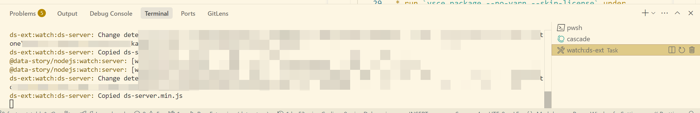
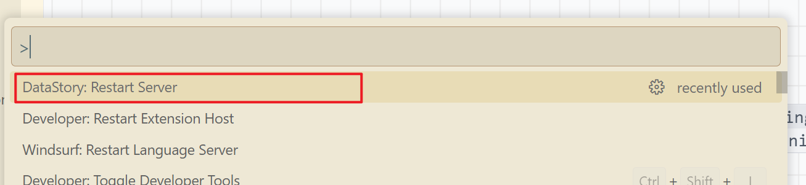

## Usage Notes

### To increase the memory limit for the extension

Set [`ds-ext.additionalDsServerCliArgs`](vscode://settings/ds-ext.additionalDsServerCliArgs) with the following:
```json
{
    "ds-ext.additionalDsServerCliArgs": [
        "--max_old_space_size=10240"
    ]
}
```

## Development Notes
1. Clone the repository.
2. In the root directory, run `yarn` to install dependencies, then `yarn build` to build the project.
3. Open the repo with an editor supporting the VS Code extension API, such as VS Code, Windsurf, or Cursor (collectively "Editor").
4. In the "Run and Debug" tab, click "Run Extension" to launch a new Editor instance.
5. In the new instance, open a directory and create a *.ds file with some content.


6. The Editor's terminal will automatically run the `watch:ds-ext` task.
   * After modifying code under `data-ui/core/ds-ext`, restart the extension (Ctrl/Cmd + Shift + F5, then type "Reload Window") to apply changes in the new Editor instance.
   * After modifying code under `data-nodejs`, wait for the `watch:ds-ext` task to output `Copied ds-server.min.js`, then restart the DataStory server to apply changes in the new Editor instance.



## publish ds-ext to VSCode extension marketplace

* run `yarn turbo ds-ext#build`
* run `vsce package --no-yarn --skip-license` under `packages/ds-ext`
* run `vsce publish` under `packages/ds-ext`
